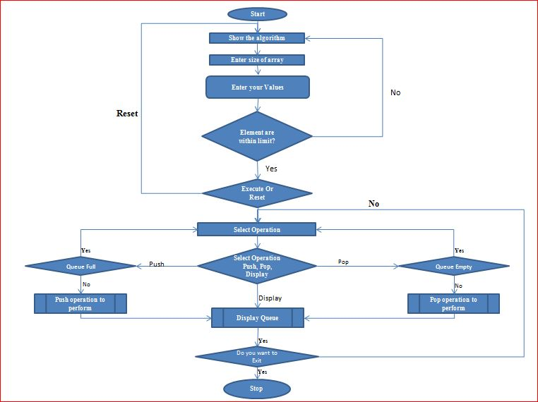
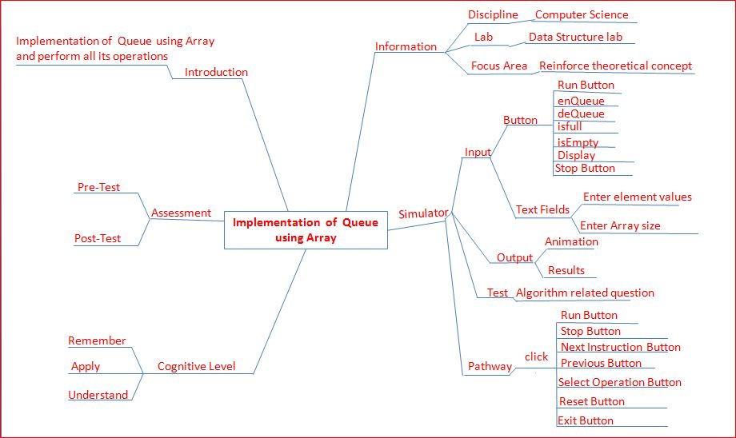

## Storyboard (Round 2)

Experiment 1: Implementation of Queue using array 

### 1. Story Outline:
In this experiment user will click on "run" button to run the simulator as well as algorithm. Once the global variable declared by the simulator which is shown by animation then it will ask for array size. The array size is given by user  
Once the array size is inserted an array will make in animation part. User will free to choose any operation like deQueue enQueue e.t.c. whatever operation is choosing by user the working animation  of that operation will show in animation part and output will shown in console part. 
### 2. Story:
The experiment "Implementation of queue using array" is array visualization of queue. For this purpose we should visualize the concept of working operations. There are five operations in operation tab that is Isfull,Isempty, deQueue, enQueue and diplay. According to that operation which has to be selected user will able to work on that operation and visualize the conceptwith the help of real time animation shown in simulator. 
For checking the undertanding knowlede of student we add some assesment task after completion of one operation. 
There are three part of simulator that is algorithm, animation and consol with operation. We add some buttons like "reset" for reset the consol and "run" for run the main function and "stop" for going back to initial stage.

#### 2.1 Set the Visual Stage Description:
1. The simulator is divided into three part. First part is algorithmic part, where algorithm will show. The second part is animation part,where realtime animation will show. And the third part is consol,where user will gives the input if require.
2. When user click on "run" button then simulator will set on its working mode and the main function will run. After that it will asign the global variables in animation part.
3. When user click on any operation in operation-tab then algorithm of that part will be executed and animation of execution will shown in animation part.
4. The array size rage is 4 to 9. It means that the input is in between the range.
5. The input of array size and array value is given by user.
6. After one operation, one assesment question will be pop-up. While answer of that question is not correct, pop-up will shown.
7. Once the all operation will perform by user then it will understand the working concept of experiment.

#### 2.2 Set User Objectives & Goals:
The main objectives of user is that the user will undertand the working concept of the algorithm, for this user can do some operation on simulator and read the algorithm of that opration by which he/she can understand the algorithmic concept of experiment. User will able to realize the working concept of algorithm by real time animation. 

#### 2.3 Set the Pathway Activities:
1. Student click on "simulator" link to open the simulator. 
2. Student will able to see the interface of simulator. Andby cliking on "simulator" user will able to go on simulator landing page. 
3. Student click on "Run" button to proceed the simulator. 
4. Enter the array size (maximum limit is 9 and minimum limit is 4). 
5. Enter the elements of array. 
6. As the elements are entered one by one the simulator will perform action as per functions used. 
7. At the end of experiment student will able to click on "stop" button to stop the execution.

##### 2.4 Set Challenges and Questions/Complexity/Variations in Questions:

<b>1.Learning Objective: Remember</b> 
<b>Question:</b>What is basic working principle of Queue 
A. LIFO 
<b>B. FIFO</b> 
C. LIFO and FIFO both 
D. None of these 
<b>2.Learning Objective: Understand</b> 
<b>Question:</b>Which is not basic operation of Queue 
A. enQueue 
B. deQueue 
<b>C. isNull</b> 
D. IsEmpty 
<b>3.Learning Objective: Apply</b> 
<b>Question:</b>What is an array 
<b>A. Data Structure</b> 
B. Data Type 
C.Fuction 
D. None of these 

##### 2.5 Allow pitfalls:
1.While running of one operation if user will click on "stop" button then all operation and then he will click on "run" button, then all operation will start from initial stage. 
2. While proper answer is not given by user pop-up will shown, but when the answer is correct then pop is remove automatically.On wrong answer the color of select button become red.
##### 2.6 Conclusion:
In this experiment user will able to learn the array implementation of queue with their working animation, which is plus point of this simulator. After completion of this experiment user will be able to get the concept of Queue, enQueue, deQueue and IsFull, Is empty condition. Task assessment questions will improve the knowledge of known concepts, which included in last of the simulator session. 

##### 2.7 Equations/formulas: NA

### 3. Flowchart 4
 
 

### 4. Mindmap:

  
 
### 5. Storyboard :
Storyboard: <a href="storyboard/vgif.gif"> [here]</a>
